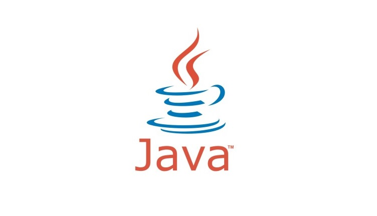

# Primeros Pasos 

## Cómo empezar a programar?

Esa puede ser la duda de muchos de quienes desean iniciarse en la  programación, principalmente porque existen una gran magnitud de lenguajes para múltiples propósitos y distintas 
funcionalidades, sin embargo algo que siempre debe tomarse en cuenta es que lo más importantes es aprender la lógica de la programación, es algo que aplica para cada lenguaje y 
que al aprenderla te facilita el aprendizaje de cualquier otro lenguaje o nuevas tecnologías. 

## Índice 

* [Qué lenguaje elegir?](#Que_lenguaje_elegir)
* [Hola Mundo]()
* [Tipos de datos]()
* [Condicionales]()
* [Ciclos]()

## Qué lenguaje elegir?

Hay varios tipos de lenguaje, ahí es donde entra el trabajo de investigación sobre  en qué campos y para qué es usado principalmente cada uno y qué ventajas y desventajas tiene. Parte de la 
elección consta en saber por qué queremos aprender ese lenguaje, hacia qué rama deseamos desarrollarnos, qué cosas se pueden hacer con facilidad en ese lenguaje (con respecto a otros) y sobre 
qué plataformas. Si deseamos aprender desarrollo web se puede iniciar en html y css antes de empezar a programar de verdad y luego ir a javascript y php, C++ y C# si se quiere iniciar en el 
desarrollo de videojuegos, Java, Kotlin, Swift son lenguajes usados en aplicaciones movil, python es una buena opción para segurirdad informática.

Cabe resaltar que no son casos exclusivos, cada lenguaje puede ser útil en distintos campos de la programación, por lo que no debes limitarte.

A la hora de programar por primera vez muchos pueden llegar a optar por [python]() por ser un lenguaje con una sintaxis sencilla y de muchas funcionalidades, sin embargo creo que 
para empezar es mejor el uso de lenguajes como C o C++, no solo por la enorme cantidad de documentación e información gratuita (que es igual con python) sino que en estos lenguajes aprendes más 
sobre los conceptos de la lógica de programación, los tipos de datos, cómo manejar las variables y la memoria, python es un lenguaje muy dinámico por lo que muchas de estas nociones 
básicas pueden perderse para alguien que está aprendiendo desde 0.

Por experiencia propia me parece que C++ es un buen lenguaje para iniciar, y dejo presente un gran curso que me ayudó en mi aprendizaje de la programación y el lenguaje, dado 
por el gran canal de [programación ATS](https://youtube.com/playlist?list=PLWtYZ2ejMVJlUu1rEHLC0i_oibctkl0Vh)

Ahora, para esta práctica he decidido aprender un nuevo lenguaje, voy a proponerme a aprender Java y comenzaré por aprender lo que pueda sobre Java como lenguaje.

* **Qué es Java?:**
Java es un lenguaje de programación basado en el paradigma de programación orientado a objetos (Como C++), el cual tiene utilidades para distintos campos del desarrollo como backend, desarrollo 
móvil (Android), desarrollo de videojuegos (como el cado de Minecraft), programación en redes y en [IoT](https://www.redhat.com/es/topics/internet-of-things/what-is-iot), además de que Java 
ofrece la ventaja de poder ser ejecutado en múltiples sistemas operativos, solo requieren la máquina virtual de Java para correr el software.

* **Cómo funciona Java?:**
Como fue mencionado, Java es un lenguaje que puede correr con facilidad en distintos sistemas operativos, esto se debe a que cuando compilas un programa en Java este no genera código de máquina 
directamente, crea un código intermedio conocido como [Byte Code](https://es.wikipedia.org/wiki/Bytecode), el byte code es un binario comprendido por la máquina virtual de java, cuando lo 
ejecutas la máquina virtual es la encargada de traducir el byte code a código de máquina para el sistema operativo del dispopsitivo y luego lo ejecuta, en este sentido tiene cualidades de 
compilador e intérprete, un compilador de código fuente a byte code y el intérprete de byte code a código objeto.

* **Por qué Java?:**
Bueno, ya he programado en algún que otro lenguaje, sin embargo jamás he escrito con éxito un programa en este lenguaje, lo que me motiva a aprenderlo por las posibilidades que este otorga. En 
particular estoy orientado al desarrollo de aplicaciones web y Java me puede ser útil en esto, tanto backend como dar el salto al desarrollo de aplicaciones móviles, quizas hasta de escritorio.

 Una vez tienes definido el lenguaje que quieres aprender necesitas las herramientas, el software que necesitas y hacer tu primer programa para verificar que todo funcione bien, debes 
hacer tu primer Hola mundo.

 
