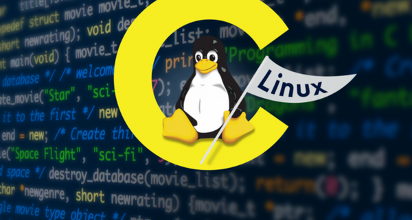

# El procesamiento

## Qué es un Programa y cómo se ejecuta?

Todos hemos manejado un programa de computadora, hay una enorme variedad de ellos, para distintos fines, distintas areas de trabajo, distintos propósitos.
Pero muchos no saben como estos son creados, lo que es realmente el software y como le da vida a nuestra computadora, puede que si eres entusiasta a la
programación ya sepas unas cuantas cosas, quizá mas que el resto, pero siempre hay agujeros, siempre los habrá, inlcuso ahora cuando escribo soy solo 
otra persona con mas interrogantes que respuestas.

En aspectos generales un programa de computador son solo una serie de instrucciones binarias que el procesador puede intender y ejecutar en el orden en que le
son dadas, este conjunto de ordenes se conoce como algoritmo, el cual podemos definir como una serie de pasos o instrucciones que deben seguir para 
obtener un resultado, tal como los pasos para armar un mueble o una receta de cocina.

Los programadores son los encargados de elaborar y escribir dichos algoritmos, son quienes construyen los programas que el procesador debe ejecutar. Entonces sabemos
que el software es elaborado por los programadores y ejecutados por el procesador... Pero cómo sucede esto?

## Índice 
* [El procesador](#El_Procesador)
* [Memorias](#Memorias) 
* [Algoritmos](#Algoritmos) 
* [Lenguajes de Programación](#Lenguajes_de_programacion)
* [Compilar e interpretar](#Compilar_e_interpretar)

## El Procesador

El procesador o CPU ( **C**entral **P**rocessing **U**nit) es la pieza central de un computador, es el cerebro que controla 
el hardware y software ( junto a otros controladores de apoyo ), es quien recibe los datos y los procesa de forma matemática y lógica.

El procesador obtiene los datos (tareas, ordenes, instrucciones) en forma de código binario ( 1s y 0s ), y son transmitidos y leídos de manera
digital como pulsos electricos donde, por ejemplo:

Un pulso eléctrico representa un:

0, si -> voltaje bajo: 0.0V - 0.8V

1, si -> voltaje alto: 2V - 5V 

El procesador, a nivel de lógica booleana, está compuesto por circuitos de [compuertas lógicas](http://service.udes.edu.co/modulos/documentos/pedropatino/compuertas.pdf), las cuales según qué par de datos binarios se reciban, se obtiene una respueta. Este mismo concepto es el que se utiliza para los circuitos electrónicos del computador y el procesador, de forma que las compuertas son representadas por millores de transistores microscópicos y los numeros binarios por pulsos eléctricos.

  

El procesador está compuesto, de esta forma, por complejos circuitos de millones de transistores que, al obtener los datos de entrada, devuelven una salida binaria.

El código binario no es comprensible por el hombre, la forma en que este código es traducido a un lenguaje etendible es mediante la regla del código ASCII, donde cada símbolo, caracter o número tiene una representación binaria de 1 Byte (8 bits). 

 

### Distribución de la Unidad Central de Proceso 

El trabajo de la CPU está dividido en varias partes, como los departamentos de un edificio empresarial (equipo de marketing, equipo de contaduría), lo que le permite trabajar
con eficiencia distintas tareas y procesos que conllevan el buen funcionamiento de un computador. 

Pero en una vista general tenemos dos módulos esenciales, la Unidad de Control y la Unidad Aritmético-Lógica:

* Unidad de Control: 

Como lo indica su nombre, esta es la parte del procesador que se encarga de manejar y administrar todos los procesos en ejecución y operaciones del sistema, número de proceso, proceso siguiente, dirección en memoria de cada instrucción, control de tiempos de ejecución, cancelar un proceso, etc.

* Unidad Aritmético-Lógica:

En esta unidad se procesan todas las operaciones matemáticas, como sumas, restas, etc,  y lógicas, como comparaciones, requeridas en función al proceso que se esté ejecutando en el momento.

 

De esta forma tenemos una visión minimalista de qué es un procesador y como opera:

* 1 - Recibe instrucciones y datos que deben ser procesados.
* 2 - Analiza los procesos que deben ejecutarse para cumplir la tarea.
* 3 - Dichos procesos se ejecutan en orden y se realizan las operaciones necesarias.
* 4 - Una vez procesadas las entradas se obtiene una respuesta o salida. 
* 5 - Finaliza el proceso.

Sin Embargo, aun con la destreza del procesador por ejecutar ordenes y devolver resultados, dichas ordenes y resultados deben almacenarse en un sitio para que puedan ser accesibles, se necesita de una memoria.

[Índice](#Indice)

## Memorias

Qué pasaría si por más que estudiaras no pudieses retener ningún tipo de información? no importa cuanto te esfuerces, a medida que lees todo lo que acabas de leer se desvanece y por más que 
empieces desde el inicio simplemente no lo recuerdas. Qué pasaría si no tuvieses memoria?

Así como nuestra mente es capaz de grandes cosas, de encontrar soluciones creativas, innovadoras y eficientes a problemas, la misma tiene la capacidad de retener grandes cantidades de
información, de igual forma el procesador tiene la capacidad computacional de resolver grandes problemas y realizar simples y complejos procesos, necesita una memoria donde poder leer y 
almacenar información.

Tener una memoria nos da la facilidad de: 

* Almacenar información
* Analizar información
* Recopilar datos
* Crear y guardar nuevos conocimientos

De esta misma forma, el procesador necesita una memoria donde poder almacenar y buscar los programas, analizar los procesos antes de ser ejecutados, guardar los resultados para poder 
consultarlos, modificarlos o reutilizarlos, crear nueva información.

Hay dos tipos de memorias en un computador, la memoria principal y memoria secundaria, las cueales sirven a distintos propósitos:

* Memoria Principal: 

Es aquella memoria volatil donde se cargan los programas y los procesos que se encuentran en ejecución y se caracterizan por ser de rápido acceso pero no 
almacenar la información permanentemente ( es eliminada al apagar la computadora ), y la más conocida de este grupo es la memoria [RAM](https://es.wikipedia.org/wiki/Memoria_de_acceso_aleatorio).

Esta es tu memoria de corto plazo, en ella está la información que necesitas para lo que sea que estes haciendo en ese preciso momento, pero mucha información de la que está ahí será olvidado
cuando te duermas, o incluso siquiera unas horas despues de haberla utilizado. 

* Memoria Secundaria: 

Es la memoria en la que puedes almacenar, leer y eliminar información, la información que se encuentra ahí es permanente, pero de acceso lento. Esta es la memoria que almacena toda la información y programas de la computadora y que los envía a la memoria principal cuando se requiere dicha información, este viene siendo principalmente tu [disco duro](https://es.wikipedia.org/wiki/Unidad_de_disco_duro) (HDD o SDD).

La memoria secundaria sería para ti tu memoria a largo plazo, esa parte de tu cerebro donde se almacena aquella información que nunca pierdes, que por más que cueste siempre puedes recordar 
lo que allí se encuentra, está guardada, no piensas en ella, solo rebuscas ahí cuando necesitas algo y utilizarlo.

**Por ejemplo:**
 Imagina que vas cocinar una de tus recetas favoritas, en todo el día no has pensado en ello, has estado ocupado en otras labores o viendo memes, pero no has pensado en la receta ni como
vas a cocinarla, no es hasta que llega el momento en que vas a la cocina que recuerdas todos los ingredientes que necesitas y los pasos necesarios para cocinar dicha receta.

De esta manera trabaja el procesador junto a las memorias, en el disco duro (memoria secundaria) se almacena toda la información y programas, pero no es hasta que se desea ejecutar una acción
cuando esta información es ubicada y leída por el procesador para posteriormente cargarla a la memoria principal para ejecutar dicha acción, de la misma forma en que tu cerebro busca la 
información y puedes recordarla conscientemente cuando es necesaria, (aunque claro la computadora no requiere horas de estudio y práctica para grabar información).  

En pocas palabras un ejemplo de una caracteristica crucial en una computadora, en el disco duro(secundaria) se instala y se almacena el sistema operativo, y al encender tu computadora el sistema escargado a la memoria ram(primaria).

Otras memorias mencionables son los [registros del CPU](https://www.profesionalreview.com/2019/11/18/registros-del-procesador/), la [memoria cache](https://hardzone.es/tutoriales/rendimiento/memoria-cache-procesador-como-funciona/) y la [ROM](https://es.wikipedia.org/wiki/Memoria_de_solo_lectura).

### Memoria Virtual: 

Aquí entra otro concepto muy importante, si los programas deben cargarse en memoria principal para ser ejecutados, cómo es que un programa que ocupa 30GB de espacio puede ser cargo en 4GB de 
RAM?. La memoria virtual es un sistema que ayuda a organizar y optimizar el uso de la memoria principal, es una simulación de memoria principal, en esta se cargan los programas que se desean
ejecutar, pero cómo sucede esto?.

Para obtener un espacio virtual (simulado) suficiente para cargar el programa se utiliza un espacio físico del disco duro, una vez cargado el programa en este espacio virtual el procesador se 
encarga de cargar a la memoria RAM solo aquella parte del programa que es necesaria, y el resto queda en la memoria virtual en caso de necesitarse o hasta que el proceso termine. Por ejemplo, si tu tienes un problema matemático y un libro de matemáticas no acudes a leer el libro completo para resolverlo, vas directo a la sección que te es útil para resolver el problema.
  
Normalmente para lograr esto con éxito, se realiza un proceso de traducción entre las direcciones de memoria virtual a direcciones reales de memoria física con el método de [paginación](https://es.wikipedia.org/wiki/Paginaci%C3%B3n_de_memoria), el cual consiste en la división del programa en pequeñas piezas (páginas) junto a una dirección falsa (marco de página), permitiendo que dichas páginas puedan cargarse en direcciones de memoria real (Memoria RAM) según se necesite.  

[Índice](#Indice)

## Algoritmos

Sabemos dónde y cómo se procesa un programa, ahora toca entender cómo se construye un programa. A menudo la tecnología puede verse como un campo amenazador por su complejidad, sin embargo 
quien se atreve a mirar puede encontrar que las bases y el inicio (como en muchos campos) son algo sencillo, ya sabemos que un programa son una serie de instrucciones que el procesador lee 
y ejecuta, esta serie o conjunto de instrucciones es lo que llamamos un algoritmo.

Un algoritmo, en términos de matemática lógica y ciencias de la computación, es una serie de pasos u operaciones lógicas que sirven para resolver un problema y llegar a una solución única. 
Aunque este término nace en el Álgebra y es usado principalmente en matemáticas o informática, podemos entender el concepto de algortimo como instrucciones a seguir para llegar a un resultado 
concreto, como un manual de instrucciones o una receta o un método para resolver un problema matemático.

En la informática entonces, programar se trata de desglozar algo que queremos lograr en pasos e instrucciones, la complejidad nace en que nuestros algoritmos no solo deben ser entendibles 
para otras personas, sino tambien para el procesador, pues es este último quien lo llevará a cabo, con la práctica notarás que aunque un algoritmo pueda ser ejecutado exitósamente no implica 
que funcione como tú hayas querido que funcionara.

### Cómo se escribe un algoritmo?

A la hora de programar, se utilizan los llamados [Lenguajes de programación](#Lenguajes_de_programacion), existen una gran cantidad de lenguajes para múltiples propósitos y orientados a distintos [paradigmas](https://profile.es/blog/que-son-los-paradigmas-de-programacion/), pero todos estos lenguajes están unidos por la lógica de programación, si dominas la lógica puedes facilmente adaptarte a otros lenguajes 
concentrando tu esfuerzo en aprender la nueva sintaxis del lenguaje. Pero para iniciar una buena forma de observar y entender la lógica de la programación básica es el uso del [pseudocódigo](https://youtu.be/KcSD3r16Pl0), el cual cumple con una sintaxis simple con Etiquetas que indican las acciones básicas de la programación como la declaración de variables, la lectura de datos de entrada, la impresión en pantalla, ciclos y condicionales, y el fin del programa. 

Otra buena opción para entender la lógica de programación es bajo el uso de [Diagramas de flujo](https://www.lucidchart.com/pages/es/que-es-un-diagrama-de-flujo), el cual es una representación gráfica de los pasos determinados de un algoritmo, como se 
desarrolla y el flujo del mismo desde su inicio hasta su final con el uso de pseudocódigo y símbolos.
 

[Índice](#Indice)

## Lenguajes de Programación

Como ya pudimos observar, un algoritmo es facilmente entendible y llevado a cabo por un ser humano, pero una computadora no comprende el lenguaje humano, además el procesador no tiene la 
capacidad del sentido común, se le debe indicar específicamente qué acciones debe tomar cada momento hasta el final de la ejecución de nuestro programa. Recordemos que el programa no son es 
más que un algoritmo escrito con instrucciones para el [procesador](#El_Procesador), por lo que programar es aprender a dar ordenes al procesador, inicialmente esto se hizo con: 

* **Lenguajes de bajo nivel:**

Los lenguajes de bajo nivel son aquellos lenguajes que interactuan directamente con el hardware de la máquina, carcaterística que añade complejidad a la programación pues esta cambia para las
distintas estructuras de hardware existentes. Además los lenguajes de bajo nivel se caracterizan por poseer una considerable complejidad sintáctica y el riesgo de dañar o afectar el rendimiento 
del hardware. Entre ellos tenemos: 
	
 -> Lenguaje de máquina:
 Como ya mencionamos el computador (incluso hoy en día) solo es capaz de entender código binario, en este nivel tan básico y complejo de la programación las diferentes instrucciones del 
procesador tienen una identficicación binaria específica, y dichas instrucciones pueden ser dadas por el programador en forma de códifo hexadecimal que es directamente leído por la computadora 
en binario. Cabe destacar que este método de programación es complejo y no es usado hoy en día. 
 
 -> Lenguaje Ensamblador:
 Es el primer lenguaje que busca asemejar la programación al lenguaje hablado, el lenguaje ensamblador usa una serie de comandos que representan las mismas instrucciones del hardware, 
lo cual facilita la programación y el entendimiento, aunque aún constaba de un considerable nivel de complejidad. El lenguaje requería una traducción de los comandos dados a instrucciones
en el lenguaje de máquina, para ello se debe utilizar un programa llamado ensamblador, y es aspectos generales su función es parecida a la de los compiladores hoy en día, traducir el
código a un lenguaje que la máquina pueda entender.

* **Lenguajes de alto nivel:**

Los lenguajes de alto nivel son los mayormente usados hoy en día, poseen como cualidad principal que su sintaxis es mucho mas comprensible y parecida al lenguaje hablado (al ingles 
principalmente) y estos son utilizados para el desarrollo de programas, aplicaciones y nuevas tecnologías con un mayor nivel de abstracción, esto se traduce en que estos lenguajes no 
se involucran directamente con el hardware y su uso no cambia según la arquitectura en la que esté siendo desarrollado el software. El desarrollo de software con estos lenguajes requiere de 
un compilador o interprete (según sea el caso del lenguaje) que tradusca el código escrito en binarios ejecutables por la computadora.  

 Un caso particular es el de los llamados lenguajes de medio nivel, que son aquellos que aun teniendo las cualidades de los lenguajes de alto nivel son capaces de interactuar directamente 
con el hardware del computador, un ejemplo destacable de esto es el lenguaje de programación **C**, el cual es predecesor de varios lenguajes y es el lenguaje usado para el desarrollo del 
[kernel](https://es.wikipedia.org/wiki/N%C3%BAcleo_(inform%C3%A1tica)) de  [Linux](https://es.wikipedia.org/wiki/GNU/Linux).

 

[Índice](#Indice)

## Compilar e Interpretar 

Una vez hemos escrito nuestro algoritmo con nuestro lenguaje de alto nivel preferido, debemos convertir ese código a instrucciones binarias ejecutables por el procesador, un proceso parecido 
al del ensamblador, pero para este punto las sintaxis de los lenguajes de programación son tan distintas que se necesitan programas más complejos para realizar la tarea, de los cuales se 
tienen los compiladores y los intérpretes.

Ambos programas tienen la misma función, traducir el lenguaje de programación en lenguaje de máquina, sin embargo sus métodos son distintos y por ende, hay ocasiones en que uno es más 
beneficioso que el otro o viceversa. La diferencia entre ambos es que el compilador transforma todo el algoritmo en un archivo binario entendible por el procesador y el intéprete no crea 
ningún archivo ejecutable, sino que por el contrario el intérprete va ejecutando el programa en tiempo real a medida que este es analizado y traducido.

Por poner un ejemplo: 

* Imagina que hay un documento cuyo contenido está en un lenguaje que no conoces y no puedes comprenderlo, por lo que le pides a un traductor que te entregue el mismo texto pero en 
tu lengua, por lo que ahora tienes un nuevo documento que sí es entendible por ti. Así funciona el compilador.

* Ahora, imagina que estás presente en una charla sobre marketing, uno de los invitados a dar uno de los temas de la conferencia resulta ser un alemán que no maneja bien el español, por lo 
que es acompañado por un intérprete, a medida que el invitado alemán da la charla el intéprete traduce al público las oraciones en tiempo real desde el inicio hasta el final de la charla. 
De la misma forma trabaja un intérprete de código.

Aunque los procesos pueden variar de lenguaje a lenguaje las etapas de la traducción del código fuente a código objeto (máquina) suelen ser las mismas, tanto 
para compiladores e intérpretes se da la etapa de añálisis del codigo fuente, y no es hasta luego en que se diferencian ambos métodos.

### Etapas de la traducción

Para esta explicación usaremos el termino **Traductor** para referirnos a programas compiladores o intérpretes por igual en las etapas compartidas de ambas 
estructuras.

**Preprocesamiento** 

Antes de iniciar con la traducción existe un término lamado "preprocesamiento" en el cual el traductor analiza el código en busca de directivas que afectan 
la manera en que dicho código será traducido. En este proceso el código fuente se ve modificado y reacomodado según las indicaciones de las directivas 
(reconocibles en C por comenzar con #) para generar un código fuente más cómodo de procesar al momento de la compilación.

**Etapa de Análisis**

* **Análisis léxico:**
 En esta etapa eli traductor reconoce las cadenas de caracteres del código fuente y las convierte en tokens (componentes léxicos) que permitirán un 
análisis detallado del codigo fuente en la etapa del análisis sintáctico.

* **Análisis sintáctico:**
 En esta etapa el traductor procesa el conjunto de tokens generado en el análisis léxico y los desgloza en un lenguaje intermedio que permitirá 
la búsqueda ordenada de errores en el código y prepararlo para generar el código binario. Este paso suele ser representado en forma de [arbol](https://es.wikipedia.org/wiki/%C3%81rbol_de_sintaxis_abstracta#Aplicaci%C3%B3n_en_compiladores).

* **Análisis semántico:**
 En esta fáse se utiliza el arbol generado para poder detectar violaciones de semántica del lenguaje, como las declaraciones y los tipos de datos en relación.

**Etapa de Síntesis**

* **Generación del código:**
 En esta fase el código fuente ya está listo para convertirse en un programa de computador, durante esta fase el código fuente analizado es convertido en 
código intermédio (parecido al código ensamblador) y posteriormente este código es traducido finalmente al código objeto (código máquina), además es en esta 
fase donde se lleva a cabo la [optimización del código](http://informatica.blogs.uoc.edu/2016/05/02/optimizacion-de-codigo-un-codigo-mas-eficiente/).

Es durante esta fase que la naturaleza del compilador y el intérprete se diferencian:

En el compilador se transforma el código intermedio en código objeto, en este proceso se genera un nuevo archivo compuesto por este código objeto, dicho 
archivo da la facilidad de poder ejecutar el programa de forma rápida y siempre que sea requerido, solo necesita ser compilado una vez para poder usarse 
las veces que se necesite. Una limitante es que el codigo objeto compilado en un sistema operativo(Windows) no suele servir para otros sistemas (MacOS), 
por lo que deben crearse distintas versiones de programas en caso de ser multiplataforma.

En los interpretes la traducción y la ejecución suceden de manera simultanea. No se genera un archivo ejecutable, sino que se requiere del código fuente 
para poder ejecutar el programa, este método, aunque más lento en ejecución que los compilados, es útil para otra clase de entornos como lo es la web. Además
del uso de máquinas virtuales por parte de algunos lenguajes para la transformación del código intermedio a objeto permiten una mayor abstracción de parte 
del software con respecto al hardware. 

**Enlace**

 Cuando se desarolla un proyecto no se suele manejar todo en un solo archivo, uno suele trabajar con distintos archivos y librerías personales. El traductor es 
capaz de reconocer y ubicar las librerías standard, pero se deben indicar la ruta de las librerías propias para que puedan ser anexadas, y es en esta etapa 
final, donde se enlaza el código de máquina principal con el de las funciones utilizadas y formar un único código ejecutable.

[Índice](#Indice)

