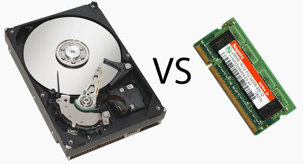

# El procesamiento

## Qué es un Programa y cómo se ejecuta?

Todos hemos manejado un programa de computadora, hay una enorme variedad de ellos, para distintos fines, distintas areas de trabajo, distintos propósitos.
Pero muchos no saben como estos son creados, lo que es realmente el software y como le da vida a nuestra computadora, puede que si eres entusiasta a la
programación ya sepas unas cuantas cosas, quizá mas que el resto, pero siempre hay agujeros, siempre los habrá, inlcuso ahora cuando escribo soy solo 
otra persona con mas interrogantes que respuestas.

En aspectos generales un programa de computador son solo una serie de instrucciones binarias que el procesador puede intender y ejecutar en el orden en que le
son dadas, este conjunto de ordenes se conoce como algoritmo, el cual podemos definir como una serie de pasos o instrucciones que deben seguir para 
obtener un resultado, tal como los pasos para armar un mueble o una receta de cocina.

Los programadores son los encargados de elaborar y escribir dichos algoritmos, son quienes construyen los programas que el procesador debe ejecutar. Entonces sabemos
que el software es elaborado por los programadores y ejecutados por el procesador... Pero cómo sucede esto?

## Índice 

* [El procesador](#El_Procesador)
* [Memorias](#Memorias) 
* [Algoritmos](#Algoritmos) 
* [Lenguajes de Programación]()
* [Compilar e interpretar]()

## El Procesador

El procesador o CPU ( **C**entral **P**rocessing **U**nit) es la pieza central de un computador, es el cerebro que controla 
el hardware y software ( junto a otros controladores de apoyo ), es quien recibe los datos y los procesa de forma matemática y lógica.

El procesador obtiene los datos (tareas, ordenes, instrucciones) en forma de código binario ( 1s y 0s ), y son transmitidos y leídos de manera
digital como pulsos electricos donde, por ejemplo:

Un pulso eléctrico representa un:

0, si -> voltaje bajo: 0.0V - 0.8V

1, si -> voltaje alto: 2V - 5V 

El procesador, a nivel de lógica booleana, está compuesto por circuitos de [compuertas lógicas](http://service.udes.edu.co/modulos/documentos/pedropatino/compuertas.pdf), las cuales según qué par de datos binarios se reciban, se obtiene una respueta. Este mismo concepto es el que se utiliza para los circuitos electrónicos del computador y el procesador, de forma que las compuertas son representadas por millores de transistores microscópicos y los numeros binarios por pulsos eléctricos.

  

El procesador está compuesto, de esta forma, por complejos circuitos de millones de transistores que, al obtener los datos de entrada, devuelven una salida binaria.

El código binario no es comprensible por el hombre, la forma en que este código es traducido a un lenguaje etendible es mediante la regla del código ASCII, donde cada símbolo, caracter o número tiene una representación binaria de 1 Byte (8 bits). 

 

### Distribución de la Unidad Central de Proceso 

El trabajo de la CPU está dividido en varias partes, como los departamentos de un edificio empresarial (equipo de marketing, equipo de contaduría), lo que le permite trabajar
con eficiencia distintas tareas y procesos que conllevan el buen funcionamiento de un computador. 

Pero en una vista general tenemos dos módulos esenciales, la Unidad de Control y la Unidad Aritmético-Lógica:

* Unidad de Control: 

Como lo indica su nombre, esta es la parte del procesador que se encarga de manejar y administrar todos los procesos en ejecución y operaciones del sistema, número de proceso, proceso siguiente, dirección en memoria de cada instrucción, control de tiempos de ejecución, cancelar un proceso, etc.

* Unidad Aritmético-Lógica:

En esta unidad se procesan todas las operaciones matemáticas, como sumas, restas, etc,  y lógicas, como comparaciones, requeridas en función al proceso que se esté ejecutando en el momento.

 

De esta forma tenemos una visión minimalista de qué es un procesador y como opera:

* 1 - Recibe instrucciones y datos que deben ser procesados.
* 2 - Analiza los procesos que deben ejecutarse para cumplir la tarea.
* 3 - Dichos procesos se ejecutan en orden y se realizan las operaciones necesarias.
* 4 - Una vez procesadas las entradas se obtiene una respuesta o salida. 
* 5 - Finaliza el proceso.

Sin Embargo, aun con la destreza del procesador por ejecutar ordenes y devolver resultados, dichas ordenes y resultados deben almacenarse en un sitio para que puedan ser accesibles, se necesita de una memoria.

[Índice](#Indice)

## Memorias

Qué pasaría si por más que estudiaras no pudieses retener ningún tipo de información? no importa cuanto te esfuerces, a medida que lees todo lo que acabas de leer se desvanece y por más que 
empieces desde el inicio simplemente no lo recuerdas. Qué pasaría si no tuvieses memoria?

Así como nuestra mente es capaz de grandes cosas, de encontrar soluciones creativas, innovadoras y eficientes a problemas, la misma tiene la capacidad de retener grandes cantidades de
información, de igual forma el procesador tiene la capacidad computacional de resolver grandes problemas y realizar simples y complejos procesos, necesita una memoria donde poder leer y 
almacenar información.

Tener una memoria nos da la facilidad de: 

* Almacenar información
* Analizar información
* Recopilar datos
* Crear y guardar nuevos conocimientos

De esta misma forma, el procesador necesita una memoria donde poder almacenar y buscar los programas, analizar los procesos antes de ser ejecutados, guardar los resultados para poder 
consultarlos, modificarlos o reutilizarlos, crear nueva información.

Hay dos tipos de memorias en un computador, la memoria principal y memoria secundaria, las cueales sirven a distintos propósitos:

* Memoria Principal: 

Es aquella memoria volatil donde se cargan los programas y los procesos que se encuentran en ejecución y se caracterizan por ser de rápido acceso pero no 
almacenar la información permanentemente ( es eliminada al apagar la computadora ), y la más conocida de este grupo es la memoria [RAM](https://es.wikipedia.org/wiki/Memoria_de_acceso_aleatorio).

Esta es tu memoria de corto plazo, en ella está la información que necesitas para lo que sea que estes haciendo en ese preciso momento, pero mucha información de la que está ahí será olvidado
cuando te duermas, o incluso siquiera unas horas despues de haberla utilizado. 

* Memoria Secundaria: 

Es la memoria en la que puedes almacenar, leer y eliminar información, la información que se encuentra ahí es permanente, pero de acceso lento. Esta es la memoria que almacena toda la información y programas de la computadora y que los envía a la memoria principal cuando se requiere dicha información, este viene siendo principalmente tu [disco duro](https://es.wikipedia.org/wiki/Unidad_de_disco_duro) (HDD o SDD).

La memoria secundaria sería para ti tu memoria a largo plazo, esa parte de tu cerebro donde se almacena aquella información que nunca pierdes, que por más que cueste siempre puedes recordar 
lo que allí se encuentra, está guardada, no piensas en ella, solo rebuscas ahí cuando necesitas algo y utilizarlo.

**Por ejemplo:**
 Imagina que vas cocinar una de tus recetas favoritas, en todo el día no has pensado en ello, has estado ocupado en otras labores o viendo memes, pero no has pensado en la receta ni como
vas a cocinarla, no es hasta que llega el momento en que vas a la cocina que recuerdas todos los ingredientes que necesitas y los pasos necesarios para cocinar dicha receta.

De esta manera trabaja el procesador junto a las memorias, en el disco duro (memoria secundaria) se almacena toda la información y programas, pero no es hasta que se desea ejecutar una acción
cuando esta información es ubicada y leída por el procesador para posteriormente cargarla a la memoria principal para ejecutar dicha acción, de la misma forma en que tu cerebro busca la 
información y puedes recordarla conscientemente cuando es necesaria, (aunque claro la computadora no requiere horas de estudio y práctica para grabar información).  

En pocas palabras un ejemplo de una caracteristica crucial en una computadora, en el disco duro(secundaria) se instala y se almacena el sistema operativo, y al encender tu computadora el sistema escargado a la memoria ram(primaria).

Otras memorias mencionables son los [registros del CPU](https://www.profesionalreview.com/2019/11/18/registros-del-procesador/), la [memoria cache](https://hardzone.es/tutoriales/rendimiento/memoria-cache-procesador-como-funciona/) y la [ROM](https://es.wikipedia.org/wiki/Memoria_de_solo_lectura).

### Memoria Virtual: 

Aquí entra otro concepto muy importante, si los programas deben cargarse en memoria principal para ser ejecutados, cómo es que un programa que ocupa 30GB de espacio puede ser cargo en 4GB de 
RAM?. La memoria virtual es un sistema que ayuda a organizar y optimizar el uso de la memoria principal, es una simulación de memoria principal, en esta se cargan los programas que se desean
ejecutar, pero cómo sucede esto?.

Para obtener un espacio virtual (simulado) suficiente para cargar el programa se utiliza un espacio físico del disco duro, una vez cargado el programa en este espacio virtual el procesador se 
encarga de cargar a la memoria RAM solo aquella parte del programa que es necesaria, y el resto queda en la memoria virtual en caso de necesitarse o hasta que el proceso termine. Por ejemplo, si tu tienes un problema matemático y un libro de matemáticas no acudes a leer el libro completo para resolverlo, vas directo a la sección que te es útil para resolver el problema.
  
Normalmente para lograr esto con éxito, se realiza un proceso de traducción entre las direcciones de memoria virtual a direcciones reales de memoria física con el método de [paginación](https://es.wikipedia.org/wiki/Paginaci%C3%B3n_de_memoria), el cual consiste en la división del programa en pequeñas piezas (páginas) junto a una dirección falsa (marco de página), permitiendo que dichas páginas puedan cargarse en direcciones de memoria real (Memoria RAM) según se necesite.  

[Índice](#Indice)

## Algoritmos

Sabemos dónde y cómo se procesa un programa, ahora toca entender cómo se construye un programa. A menudo la tecnología puede verse como un campo amenazador por su complejidad, sin embargo 
quien se atreve a mirar puede encontrar que las bases y el inicio (como en muchos campos) son algo sencillo, ya sabemos que un programa son una serie de instrucciones que el procesador lee 
y ejecuta, esta serie o conjunto de instrucciones es lo que llamamos un algoritmo.

Un algoritmo, en términos de matemática lógica y ciencias de la computación, es una serie de pasos u operaciones lógicas que sirven para resolver un problema y llegar a una solución única. 
Aunque este término nace en el Álgebra y es usado principalmente en matemáticas o informática, podemos entender el concepto de algortimo como instrucciones a seguir para llegar a un resultado 
concreto, como un manual de instrucciones o una receta o un método para resolver un problema matemático.

En la informática entonces, programar se trata de desglozar algo que queremos lograr en pasos e instrucciones, la complejidad nace en que nuestros algoritmos no solo deben ser entendibles 
para otras personas, sino tambien para el procesador, pues es este último quien lo llevará a cabo, con la práctica notarás que aunque un algoritmo pueda ser ejecutado exitósamente no implica 
que funcione como tú hayas querido que funcionara.

### Cómo se escribe un algoritmo?

A la hora de programar, se utilizan los llamados **Lenguajes de programación**, existen una gran cantidad de lenguajes para múltiples propósitos y orientados a distintos [paradigmas](https://profile.es/blog/que-son-los-paradigmas-de-programacion/), pero todos estos lenguajes están unidos por la lógica de programación, si dominas la lógica puedes facilmente adaptarte a otros lenguajes 
concentrando tu esfuerzo en aprender la nueva sintaxis del lenguaje. Pero para iniciar una buena forma de observar y entender la lógica de la programación básica es el uso del [pseudocódigo](https://youtu.be/KcSD3r16Pl0), el cual cumple con una sintaxis simple con Etiquetas que indican las acciones básicas de la programación como la declaración de variables, la lectura de datos de entrada, la impresión en pantalla, ciclos y condicionales, y el fin del programa. 

Otra buena opción para entender la lógica de programación es bajo el uso de [Diagramas de flujo](https://www.lucidchart.com/pages/es/que-es-un-diagrama-de-flujo), el cual es una representación gráfica de los pasos determinados de un algoritmo, como se 
desarrolla y el flujo del mismo desde su inicio hasta su final con el uso de pseudocódigo y símbolos.
 

[Índice](#Indice)
